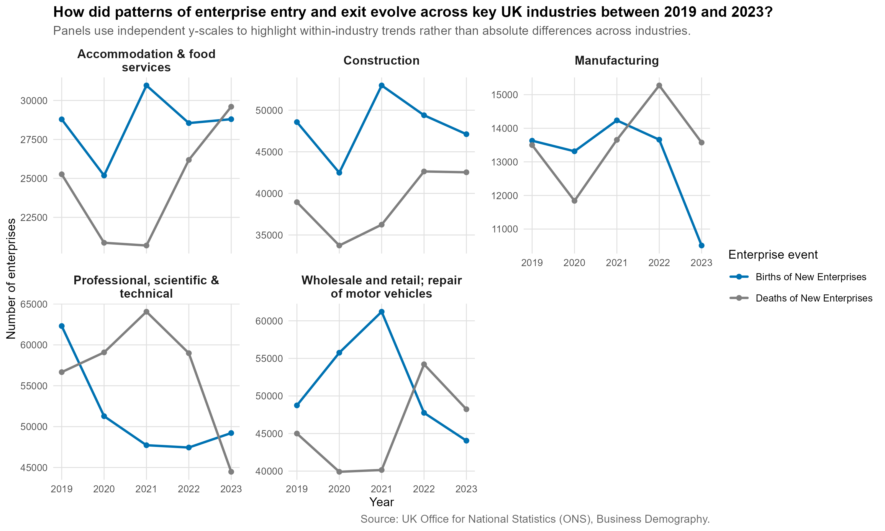
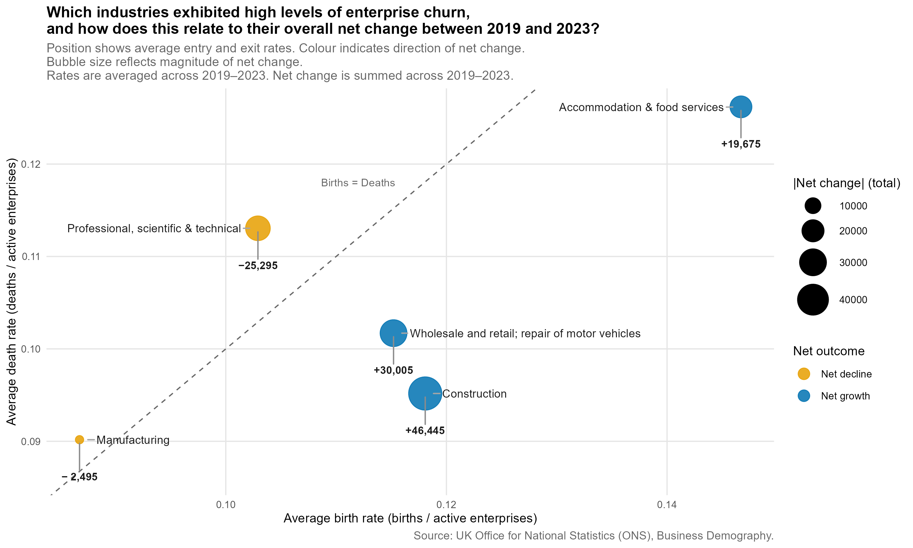
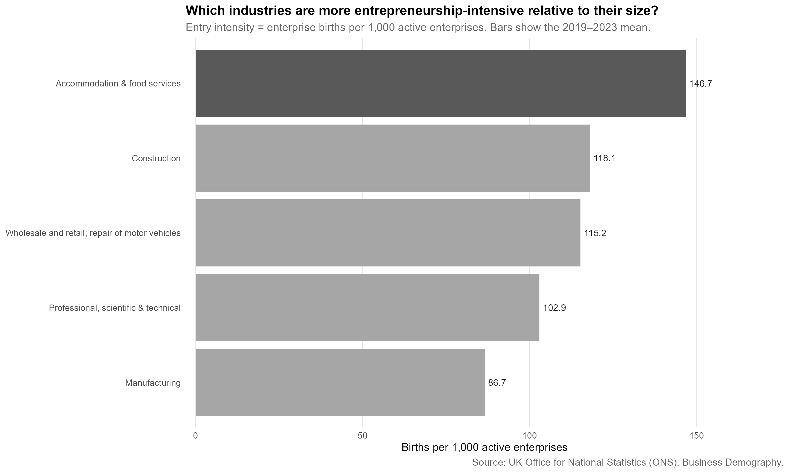
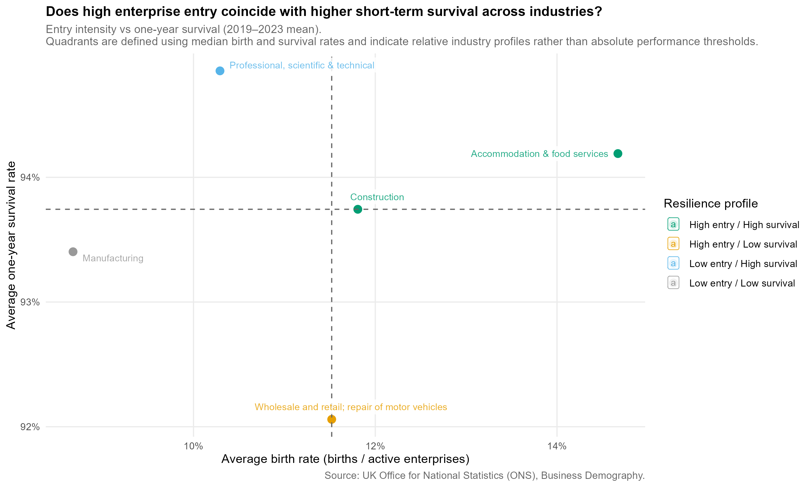
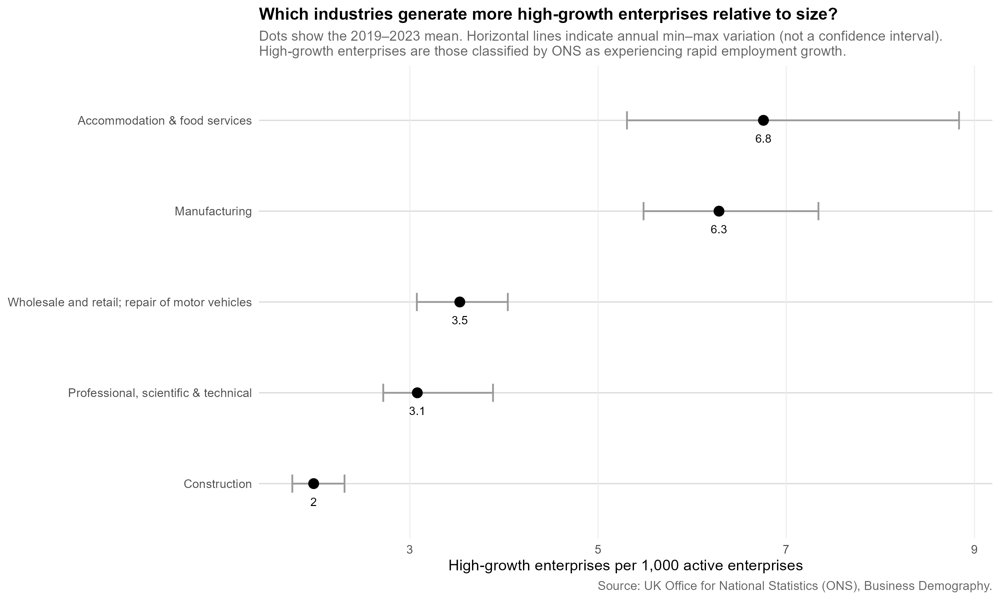

# IJC445-Data-Visualisation-Coursework-Project

# Enterprise Dynamics across UK Industries (2019–2023)

## Overview
This project explores how patterns of enterprise entry, exit, survival, and growth differed across major UK industries between 2019 and 2023. Using official UK Office for National Statistics (ONS) Business Demography data, a composite visualisation is developed to examine multiple dimensions of business dynamism together rather than relying on single indicators.

This repository is published as a GitHub Pages project site at:  
[https://usern102.github.io/IJC445-Data-Visualisation-Coursework-Project/](https://usern102.github.io/IJC445-Data-Visualisation-Coursework-Project/)

**GitHub Repository:**  
[https://github.com/userN102/IJC445-Data-Visualisation-Coursework-Project](https://github.com/userN102/IJC445-Data-Visualisation-Coursework-Project)

## Research question
How did enterprise entry, exit, survival, and growth dynamics differ across key UK industries between 2019 and 2023?

## Composite visualisation
The final output is a **composite visualisation consisting of five coordinated charts**, each highlighting a different aspect of enterprise dynamics:
### Figure 1. Enterprise births and deaths over time  

### Figure 2. Enterprise churn and cumulative net change  

### Figure 3. Entry intensity relative to industry size  

### Figure 4. Entry rates versus short-term survival  

### Figure 5. High-growth enterprises relative to size  

All visual outputs are saved as PNG files in the `Visuals/` folder.

## Data source
All data are drawn from the UK Office for National Statistics (ONS) Business Demography dataset.  
The original Excel file (`ons_original.xlsx`) is stored in `Dataset/ONS_Business_Demography/` and contains tables on enterprise births, deaths, survival, active enterprises, and high-growth firms by industry and year.

## Software requirements
The analysis is implemented in **R**. Required packages include:
- tidyverse  
- readxl  
- readr  
- stringr  
- ggrepel  
- scales 

## How to run the project
All R scripts are located in the `Codes/` folder:  
[https://github.com/userN102/IJC445-Data-Visualisation-Coursework-Project/tree/main/Codes](https://github.com/userN102/IJC445-Data-Visualisation-Coursework-Project/tree/main/Codes)

Run the R scripts in the following order:

1. **Extract and clean raw ONS tables**
   - `active_enterprises_industry.R`
   - `enterprise_births_industry.R`
   - `enterprise_deaths_industry.R`
   - `enterprise_survival_industry.R`
   - `high_growth_enterprises_industry.R`

2. **Merge cleaned industry-level datasets**
   - `merge_industry_demography.R`

3. **Aggregate division-level data to industry sections**
   - `section_level_demography_data.R`

4. **Generate composite visualisations**
   - `section_year_demography_visuals.R`

All required output folders are created automatically if they do not exist.

## Outputs
- Cleaned and merged datasets are saved in `Dataset/Final_Master_Datasets/`
- Five visualisations are saved as PNG files in the `Visuals/` folder:
  - Enterprise entry and exit over time
  - Enterprise churn and net change
  - Entry intensity by industry size
  - Entry versus short-term survival
  - High-growth enterprises relative to size

## Key findings
- Industries with similar levels of enterprise entry often exhibit very different net outcomes once exit is taken into account.
- High entrepreneurial churn does not necessarily imply long-term growth, particularly when entry and exit rise together.
- Entry intensity varies substantially across industries after adjusting for size.
- High entry rates do not always coincide with higher short-term survival.
- A small number of firms account for a disproportionate share of high-growth activity, regardless of overall entry levels.
